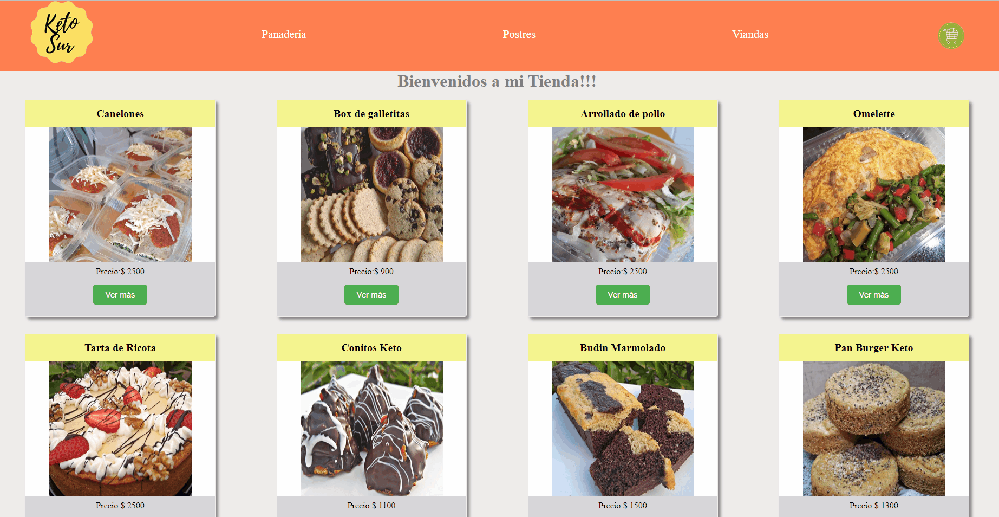

# Ecommerce - KetoSur

  

  

## Descripción del Proyecto

 Aplicación Ecommerce realizada en ReactJS.

 

## Funcionalidades

- `Visualizar todos los productos:` Al ingresar a la aplicación se permite visualizar todos los productos disponibles para la compra.

- `Filtrar por categoría:` Al navegar entre las opciones del menú se filtran los productos según la categoría de los mismos.

- `Agregar productos al carrito:` Se permite detallar el producto y agregarlos al carrito de compras.

- `Visualizar carrito de compras:` Mediante el icono del carrito se puede ver el detalle de los productos añadidos y el total de la compra. También posible eliminar productos del carrito.

- `Completar Orden de compra:` Al ingresar todos los datos requeridos del comprador se puede finalizar la compra almacenando la orden en Cloud Firestore.

## Desarrollado con

- React js
- React Router
- React Hooks
- Context

## Ferramentas utilizadas

  </a>

## Características
- Los datos se consultan a Cloud Firestore
- El proyecto maneja una unica hoja de estilo css.

## Instrucciones para clonar

Clonar

- git clone https://github.com/LorenaCardozo/KetoSur

Instalar dependencias de desarrollo. Nota: Consulte el motor de package.json para ver nuestras versiones de nodos compatibles y probadas.

- npm install

Ejecutar

- npm start